# FClassPal

> FClassPal是一个主要为班级大屏打造的桌面快捷方式启动器小部件 可用于替代希沃管家助手/桌面助手

    

**FClassPal**是一个常驻桌面的启动器小部件，用于替代希沃管家助手/桌面助手 把常用的应用、文件、文件夹和网页钉在桌面一角，顺手管理 U 盘的弹出。无任务栏图标——右键或长按唤醒菜单，其余时间安静地贴在桌面上。

## 使用

双击即用 使用本应用建议卸载希沃桌面助手/隐藏桌面管家（可使用[HugoAura-Enhanced](https://github.com/blingbling-bow/HugoAura-Enhanced)中的功能彻底隐藏掉）

## 功能

- **快捷方式管理**：应用（.exe）/ 文件 / 文件夹 / 网页四种类型；exe 自动提取图标，也可自选图片或字符；支持分组
- **图标外观**：填充方式可选「内部」（图片**完整落在边框形状之内**，按内切解留白 `0.2929 × 半径`，带字的图与异形图标都不会被圆边切角）或「裁剪」（填满圆形裁掉多余）；形状可选「跟随主题 / 圆形 / 圆角 / 方形」（圆角可调 4–50%）；边框可选「自动取色」（描边 / 外发光 / 底色都取这张图自己的主色）、「跟随主题」（用当前主题的强调色，换风格、换壁纸自动跟着变）、「透明」或「玻璃白边」，也可以**直接指定颜色**。「内部」下还能开**统一图标风格**：所有图标收敛到同一个颜色，图片按自己的形状染成单色（明暗细节保留，认得出是哪个应用），预设与字符图标直接换色——像 Pixel 的主题图标那样一整套图标统一取色。没开统一风格时，预设图标与字符图标取色退回当前主题的强调色
- **U 盘管理**：自动列出即插 U 盘，一键打开；安全弹出采用五层降级策略（设备节点 → 卷级 IOCTL → Shell 动词 → WMI 卸载 → mountvol），每层都校验盘符真的消失，全失败时给出一键「管理员重试」
- **窗口控制**：透明度、圆角弧度（8–40px）、尺寸、置底、锁定位置、开机自启、隐藏到托盘、隐藏任务栏图标
- **明暗模式**：十套主题都支持明亮 / 暗色两套观感。动态配色主题走 Monet 官方暗色方案重算整套角色（主色色相守恒，主题身份色不漂）；固定配色主题只压暗表面、绝不动强调色——Kitty 在暗色下依然是粉的
- **自定义背景图**：可以拿自己的图片当底材，可调模糊（0–40px）、白色蒙版（0–100%）、缩放与位移（合起来就是裁剪）、铺法；背景图同时作为取色源，玻璃配色跟着新底材走
- **壁纸取色**：Material You 官方算法（`QuantizerCelebi` 聚类 → `Score` 打分 → `SchemeTonalSpot` 派生），也支持手动指定主色走同一条派生链路
- **触控优先**：Pointer Events 全链路，长按 = 右键，触摸屏上不闪不抖

## 十套主题，十套设计系统

十套主题**不是同一套壳换色**——每套都有自己的形状语言、表面处理、按钮样式、圆角半径、模糊强度和按压动效：

| 主题 | 设计语言 | 配色 |
|---|---|---|
| `glass` 液态玻璃 | 四层玻璃结构 + SVG 位移贴图折射 | 跟随壁纸（Monet） |
| `md3` Material You | Material Design 3，ripple 按压 | 跟随壁纸（Monet） |
| `fluent` Fluent | Reveal 光斑、8px 小圆角 | 跟随壁纸（Monet） |
| `miuix` MIUIX | HyperOS 缓动 + Sink 下沉按压 | 官方固定色 `#3482FF` |
| `harmony` 鸿蒙 | 「沉浸光感」边缘流光环 | 官方固定色 `#0A59F7` |
| `kitty` | 凯蒂猫贴图 ×10 处 | `#E8548A` |
| `dog` | 玉桂狗贴图 ×6 处 | `#4FA8E8` |
| `kuromi` | 库洛米贴图 ×7 处，邪气侧倾按压 | `#8E5BC8` + 骷髅粉 |
| `melody` | 美乐蒂贴图 ×7 处，软糯缩放 | `#EC6FA8` |
| `sanrio` | 三丽鸥混合，9 处表面轮换四家角色 | 粉 / 紫 / 蓝合体 |

十套主题都能切明亮 / 暗色，窗口圆角也可以在 8–40px 之间单独调（默认跟随主题）。

| glass | md3 | fluent | miuix | harmony |
|---|---|---|---|---|
| 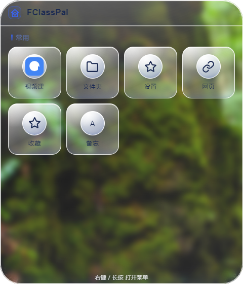 | 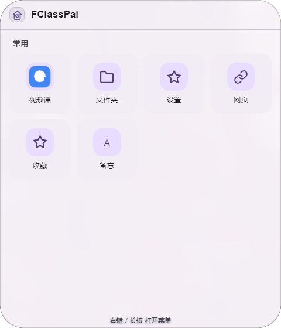 | 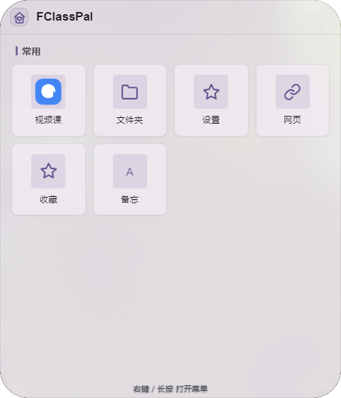 | 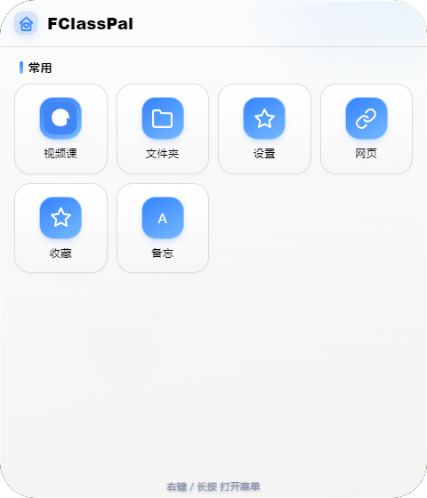 | 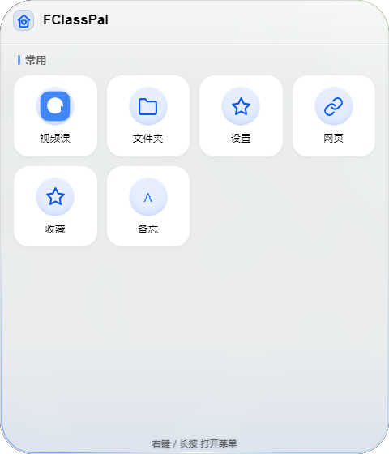 |

| kitty | dog | kuromi | melody | sanrio |
|---|---|---|---|---|
| 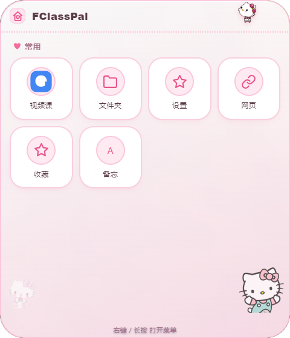 | 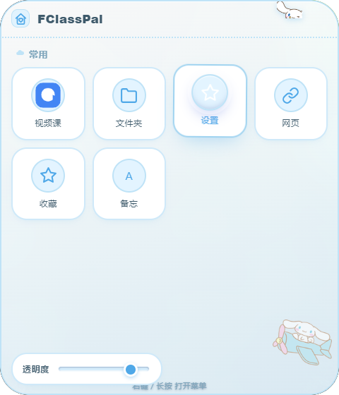 | 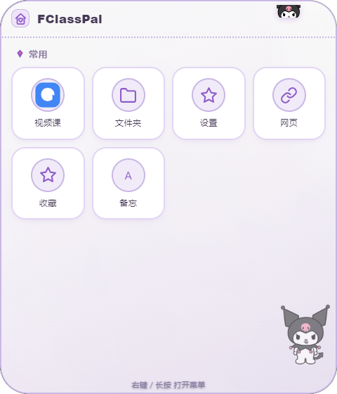 | 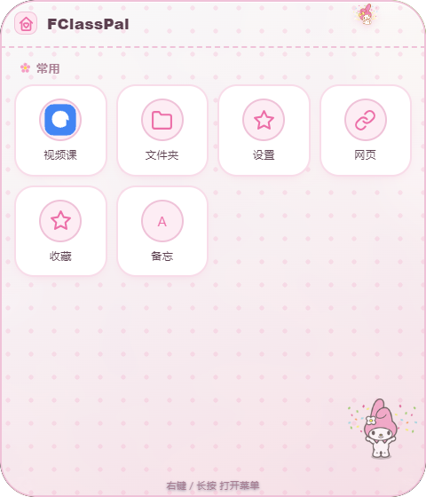 | 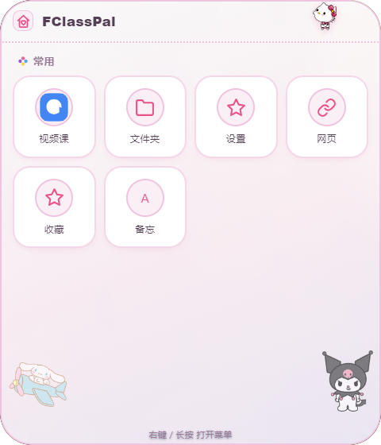 |

液态玻璃的折射效果（左：无折射；右：standard 模式位移贴图，边缘 3× 放大）：

| 无折射 | 折射后 | 边缘 3× |
|---|---|---|
| 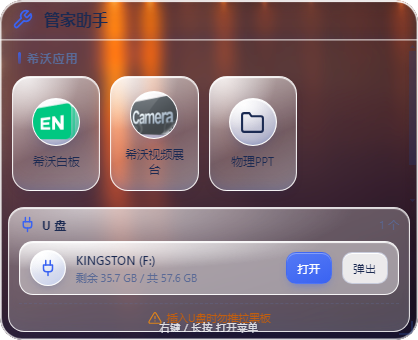 | 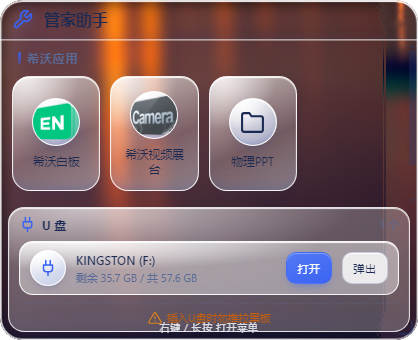 | 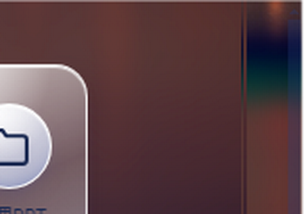 |

图标外观（v2.4.2–v2.4.4 的合力）——「内部」填充 + 圆形 + 边框跟随主题 + 统一图标风格（所有图标统一成主题强调色，Pixel 风格）：

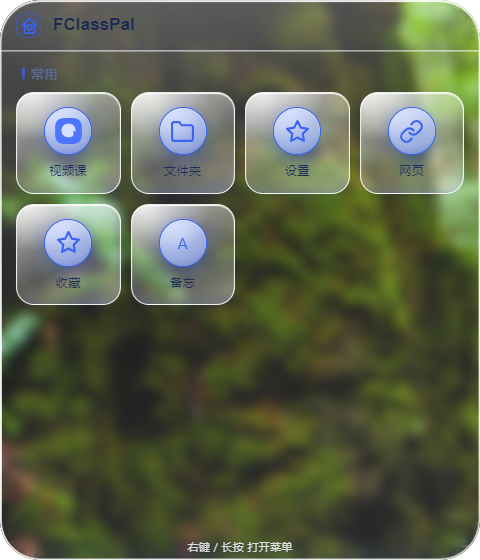


## 技术要点

- **四层玻璃结构**：底材层 → warp 层（只挂 `filter` 与 `backdrop-filter`）→ veil 层（白纱/描边/投影）→ 内容层。折射用预烘焙的 256×256 SVG 位移贴图 + `feDisplacementMap`（standard 模式，借鉴 [liquid-glass-react](https://github.com/rdev/liquid-glass-react)）
- **壁纸取色**：`@material/material-color-utilities` 是 ESM 包，而 Electron 的 asar 不支持 ESM 解析，所以用 esbuild 预打成单文件 CJS（`vendor/monet.js`）
- **窗口圆角**：`transparent: true` + 每像素 alpha（不用 Mica——它与 transparent 互斥，会毁掉圆角且 `backdrop-filter` 采不到）
- **拖动**：Pointer Events + `screenX/screenY` 算位移 + rAF 合并 + 主进程 `setPosition`；拖动期间主进程暂停回推 bounds，避免自激振荡
- **U 盘弹出**：`CM_Get_Parent` 上溯到 USB 父设备节点；卷级走 `FSCTL_LOCK_VOLUME` → `IOCTL_STORAGE_MEDIA_REMOVAL` → `FSCTL_DISMOUNT_VOLUME` → `IOCTL_STORAGE_EJECT_MEDIA`，可移动卷免管理员
- **自定义背景图**：图层与壁纸层同层（`z-index:-1`）但排在它之后，仍在折射层之下，所以 `backdrop-filter` 采样到的就是这张图；白蒙版是同一元素上的第二层 `background-image`，模糊走 `filter: blur()`，缩放走 `transform: scale()`（带 `blur/160` 放大补偿）
- **图标取色**：与壁纸取色同一套 Monet 引擎，但关掉 `Score` 的候选过滤（图标多是低饱和/深色，默认过滤会全部拒掉、塌回回退紫），并跳过透明像素（图标 PNG 带透明留白，一起统计会让主色恒为黑，每个图标都套一圈黑边）；一次 IPC 批量取全部图标的主色，首帧即着色，避免"先主题色再跳图片色"的闪烁
- **图标内切**：`object-fit: contain` 只保证内切于**方框**，方形图的四角依然在圆外。按正方形内切于圆角矩形的解析解留白：`内缩 = 0.2929 × 圆角半径`（`0.2929 = (1 − 1/√2)/2`）。圆角百分比是相对**边框盒**、图片内缩百分比是相对父级**内容盒**，两者换算要过边框宽度；「跟随主题」时圆角由主题决定，必须**实测**再算
- **主题跟随色**：纯 CSS 回退链 `--ic-c: var(--ic-ring-c, var(--t-accent, var(--accent)))`，JS 在「跟随主题」这一档一个颜色变量都不写——没有钩子就不会有陈旧色；外发光 45% / 底色 20% 的透明度用 `color-mix()` 现算，同理免钩子
- **统一图标风格**：统一色由 body 一处下发（逐图标写内联值会把"一个色"拆成 N 份）；图片的形状靠 CSS 蒙版（`--ic-mask`，JS 从元素自己的 `` 取已编码的绝对 URL），蒙版层 `inset: var(--ic-pad)` + `mask-size: contain` 与图片的 `padding + object-fit: contain` **逐像素对齐**（对不齐的症状是统一色飘在图标旁边）；`mix-blend-mode: color` 让色相取统一色、明暗仍来自图标本身（细节留着、认得出应用）；`:has(img)` 保证没有图片的图标不长出这一层（否则 mask 取不到值会退回 none = 整块涂满）

## 测试（841 项断言，八层验证）

| 层 | 命令 | 数量 | 说明 |
|---|---|---|---|
| 源码层 | `node smoke-test.js` | 361 | jsdom 跑 renderer 逻辑 |
| 打包层 | `node _check.js` | 233 | 从 `dist/win-unpacked/resources/app.asar` 解包逐项断言 |
| 取色层 | `node _rt/_palettecheck.js` | 50 | 真 `vendor/monet.js` 产出的 palette 喂真 `renderer/app.js` |
| 真机取色 | `electron _rt/_monetcheck.js` | 48 | 真 Electron + 合成壁纸验 Monet（含明暗两套方案） |
| 真机图形 | `electron _rt/_garblecheck.js` | 64 | 真实产品页逐主题验 `<body>` 计算样式干净 + 81 点命中测试 |
| 真机背景 | `electron _rt/_bgcheck.js` | 22 | 拉起真 `main.js` 验背景图真的能加载、响应不卡 |
| 真机图标 | `electron _rt/_iconcheck.js` | 56 | 合成异形测试图验取色 / 描边 / 外发光 / 底色 / 填充 / 形状 / 内切几何 / 统一风格，读 computed 样式 |
| 拖动落盘 | `electron _rt/_dragcheck.js` | 7 | 真 Electron 验 saveBounds |

全部绿了才交付 exe。

想在构建前预跑打包层的断言（省掉一轮打包往返）：

```bash
node _mksrccheck.js && node _check_src.js    # 由 _check.js 生成源码版，只换读文件的方式
```


## 下载

免安装便携版（Windows x64，约 94MB）：**[FClassPal-2.4.4.exe](https://github.com/fangyugit/FclassPal/releases/download/v2.4.4/FClassPal-2.4.4.exe)** · [全部版本](https://github.com/fangyugit/FclassPal/releases)

改动记录见 [CHANGELOG.md](CHANGELOG.md)

## 运行与构建

```bash
npm install

# 开发运行
npm start

# 打包 Windows 便携版（产物：dist/FClassPal-<version>.exe）
npm run build:portable

# 跑回归测试
node smoke-test.js
node _check.js            # 需先打包
node _rt/_palettecheck.js
```

## 目录结构

```
FclassPal/
├── main.js              # Electron 主进程：窗口 / IPC / U 盘弹出 / 壁纸同步
├── preload.js           # 上下文隔离桥
├── renderer/
│   ├── index.html       # 无边框 UI：主界面 + 右键菜单 + 设置面板 + 弹窗
│   ├── style.css        # 十套主题（每套是一份独立设计系统）+ 明暗模式 + 自定义背景图
│   ├── app.js           # 交互逻辑：拖动 / 菜单 / 主题 / 取色应用
│   └── lg-displacement-map.js   # 预烘焙折射位移贴图（MIT © 2025 MAX ROVENSKY）
│   └── theme/           # 角色主题贴图素材
├── vendor/monet.js      # esbuild 预打包的 Material You 取色（CJS）
├── smoke-test.js        # 源码层回归（361 项）
├── _check.js            # 打包层回归（234 项）
├── _mksrccheck.js       # 由 _check.js 生成源码版 _check_src.js（构建前预跑）
├── CHANGELOG.md         # 更新日志
├── _rt/                 # 运行时验证与素材管线脚本
├── tools/               # 托盘图标生成
└── docs/                # 截图
```

## 声明

### 作者

OrionYU

### AI声明

本项目部分代码由 **WorkBuddy** 生成，在真实设备（希沃 MT41A-JHB）上编译，并已在班级中长时间实际使用。

### 提示

- 仅支持 Windows 10/11（依赖 DWM 模糊、WMI、Cfgmgr32）
- 开启「实时桌面模糊」后，系统截图/录屏会看不到本窗口（Windows 采集排除机制所致）
- 「自定义背景图」的白蒙版可以替代模糊达到「虚化但不透出桌面」的效果，两者也能叠加
- `renderer/theme/` 中的三丽鸥角色图片版权归 © Sanrio 及原权利方所有，仅供学习与个人使用，请勿商用
- 液态玻璃的位移贴图来自 [liquid-glass-react](https://github.com/rdev/liquid-glass-react)（MIT）

## License

[MIT](LICENSE) © OrionYU (fangyugit)
